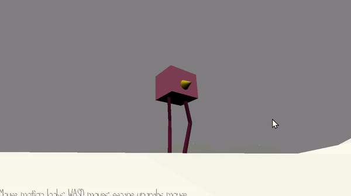

# Kitty Maze

**Author:** Ashley Kim, Joyce Zhang

**Design:** Kitty Maze is a maze game with ray collision where the player (kitty) needs to go get the orange box (goal) without being caught by the red lasers.

**Screen Shot:**

**not in game, but the procedural Walker! 

## How To Play: ##

Use mouse to pan the view and wasd keys to move around the maze.

## Sepcial Things ##
This project is an experimentational piece where we got to explore and implement the following:

* Walkmesh as base floor walking 
* Ray-box collision based on orientaiton of a mesh 
* Procedural walking animation based on target point, rig hierarchy, and orientation of body mesh
(note : procedural walking isn't shown as part of the gameplay, but the demo can be viewed in the ``joyce`` branch or the [sister repo](https://github.com/SadSaltLady/CGP-5-Walker))

### Instructions for the Procedural Walking Demo
WASD to move player character around, Left/Right arrow to turn Walker, Up/Down arrow to move in the direction its facing!
There's a hill you can climb in the map if you're interested! The stairs doesn't work though :(

## Sources: ##
* [maze generator blender plugin](https://github.com/elfnor/mesh_maze)
* [walkmesh tutorial](https://15466.courses.cs.cmu.edu/lesson/walkmesh)
* [ik in 2D](https://www.alanzucconi.com/2018/05/02/ik-2d-1/)

Other resources we looked at are commented at where the respective concept has been used throughout the file.

This game was built with [NEST](NEST.md).

